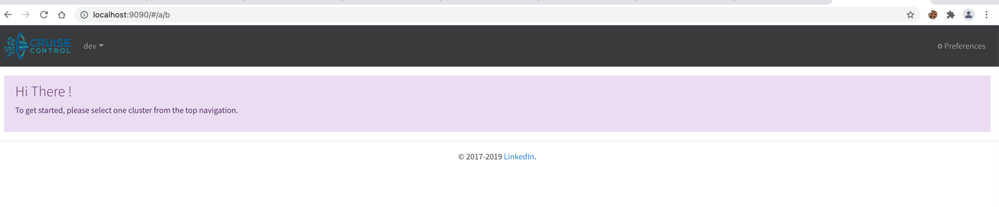
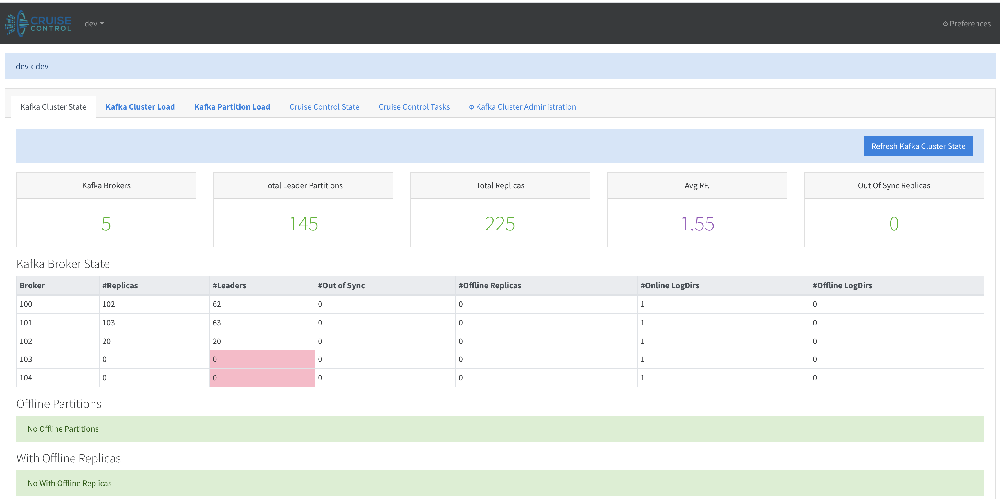
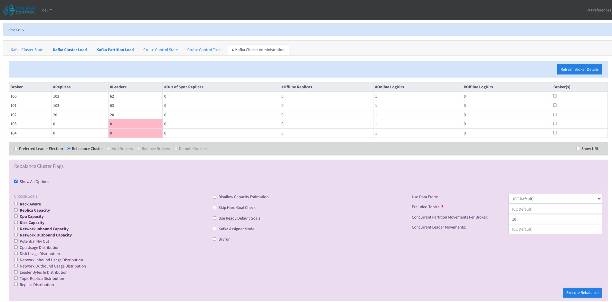

# 5 Node kafka cluster setup with Cruise Control for Cluster Rebalancing 

### Goal: 
1. Setup 2 node Kafka Cluster
2. Create 20 topics
3. Now Span up the cluster to 5 nodes
4. Rebalance using Cruise Control

### Assumptions
Java Should be installed and running

### Steps to Run Cluster setup

1. Clone the git repo to local 

       git clone https://github.com/KumarTarunTanwar/kafkaclustersetup.git

2. cd to project folder 
 
        cd /opt/kafkaclustersetup

3. Run ClusterSetup.sh

        ./ClusterSetup.sh

    #### Script Will perform below steps: 
    - Download All required binaries under /tmp/kafkacluster
    - Extracting the jars to required folders
    - Configure and start zookeeper on Port 2182 (Change changed by zookeeperPort in script)
    - Validate Node connected to server =0
            
          bin/zookeeper-shell.sh localhost:2182 ls /brokers/ids
    
    - Configure and Added two kafka brokers on port 9094/9095 and validate the connectivity with zookeeper

          bin/zookeeper-shell.sh localhost:2182 ls /brokers/ids

    - Create 20 topics with each topic replication-factor 2 and partitions 4
    - Describe All the topics 

          bin/kafka-topics.sh --zookeeper localhost:2182 --describe
  
    - Update on required config and start Cruise Control on port 9090
    - Configure and Added 3 new kafka brokers on port 9096/9097/9099 and validate the connectivity with zookeeper

          bin/zookeeper-shell.sh localhost:2182 ls /brokers/ids

    - Describe All the topics
    
    
4.  After Script Completion Cruise Control UI will be Running on http://localhost:9090/
    #####1.  Cruise Control Home
    
    

    -> Select the env
    #####2.  Kafka Cluster Status
    This page shows the realtime status of the kafka cluster and reports any URP, Offline Partitions, Disks, etc.
        
    

    #####3. Under Kafka Cluster Administration
    
    Below screen is for Doing Kafka Cluster rebalance with advanced options.

    